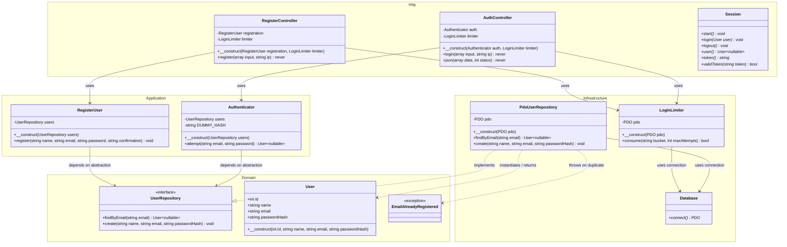

# Class Diagram & Architecture Overview

Dokumen ini memuat **Class Diagram** utama proyek **Stokora (Inventory & Order Management)** beserta penjelasan rinci hubungan antar-komponen pada setiap *layer* arsitektur.

---

## Class Diagram (Mermaid)

Berikut adalah diagram kelas UML yang menggambarkan struktur OOP, batas antarlayer (*boundary*), dan penerapan *Dependency Inversion Principle*:

---

## Penjelasan Komponen Per Layer

### 1. Domain Layer (`src/Domain`)
- **`UserRepository` (Interface):** Kontrak abstraksi untuk penyimpanan dan pengambilan data pengguna. Komponen pada layer aplikasi hanya bergantung pada interface ini.
- **`User` (Entity Class):** Objek nilai (*Value Object* / *Read-only Entity*) yang merepresentasikan data akun pengguna terautentikasi (ID, Nama, Email, Password Hash).
- **`EmailAlreadyRegistered` (Exception):** Exception khusus domain yang dilempar saat terjadi pendaftaran dengan email yang sudah ada.

### 2. Application Layer (`src/Application`)
- **`Authenticator` (Service Class):** Mengatur logika autentikasi pengguna (pencarian email, normalisasi string, dan mitigasi *timing attack* via dummy hash verification).
- **`RegisterUser` (Service Class):** Mengatur logika registrasi akun baru (validasi panjang password 12-72 byte, konfirmasi password, validasi format email, dan penyiapan password hash).

### 3. Infrastructure Layer (`src/Infrastructure`)
- **`PdoUserRepository` (Repository Implementation):** Implementasi konkrit `UserRepository` berbasis PDO MySQL. Menggunakan *prepared statements* untuk mencegah SQL Injection.
- **`Database` (Utility Class):** Penyedia koneksi PDO singleton ke MySQL berdasarkan variabel lingkungan `.env`.
- **`LoginLimiter` (Security Component):** Pengelola *rate-limiting* berbasis tabel database `login_attempts` untuk mencegah *brute-force attack*.

### 4. Http Layer (`src/Http`)
- **`AuthController` (Controller Class):** Membaca input JSON login, memeriksa rate limit, memanggil `Authenticator`, serta mengatur sesi pengguna & respons JSON.
- **`RegisterController` (Controller Class):** Membaca input JSON registrasi, memanggil `RegisterUser`, serta menangani penangkapan exception domain untuk respons status HTTP 409 / 422.
- **`Session` (Session Helper Class):** Pengelola *session cookie* (HttpOnly, SameSite), pembaruan ID sesi (*session fixation prevention*), dan pembentukan/validasi token CSRF.
