# Database Architecture & Entity Relationship Diagram (ERD)
## SIMANIS — Sistem Manajemen Inventaris & Multi-Warehouse Order System

Dokumen ini menjelaskan arsitektur database relasional lengkap untuk mengakomodir seluruh menu dan alur operasional sistem SIMANIS: **Manajemen User (SOD Matrix)**, **Master Data (Produk, Kategori, Gudang, Supplier, Customer)**, **Sales Orders (SO)**, **Purchase Orders (PO)**, **Goods Receipt & Issue**, serta **Stock Ledger Multigudang (Audit Trail)**.

---

## 1. Prinsip Desain Arsitektur Database

1. **Integritas Relasional & Segregation of Duties (SOD):**
   - Setiap transaksi memiliki relasi ke pembuat (*creator*) dan penyetuju (*approver*).
   - Penegakan integritas SOD di level relasi: relasi `created_by` dan `approved_by` mengarah ke entitas `users` dengan peran (*role*) yang tervalidasi.
2. **Immutable Stock Ledger (Audit Trail):**
   - Perubahan stok tidak pernah ditimpa secara langsung tanpa jejak.
   - Tabel `stock_ledger` bersifat *append-only* (hanya `INSERT`, tidak ada `UPDATE`/`DELETE`) yang mencatat setiap pergerakan stok keluar/masuk beserta dokumen referensi dan pengguna pelaksana.
3. **Multi-Warehouse Isolation & Real-Time Balance:**
   - Tabel `inventory_stocks` berfungsi sebagai tabel saldo stok fisik cepat (*materialized balance*) per kombinasi unik `(warehouse_id, product_id)`.
   - Mengakomodir status stok teralokasi: *Quantity on Hand*, *Quantity Reserved* (untuk SO yang disetujui namun belum dikirim), dan *Quantity Incoming* (untuk PO berjalan).
4. **Auditability & Standar Timestamp:**
   - Seluruh tabel transaksional dan master data dilengkapi kolom `created_at` dan `updated_at`.

---

## 2. Entity Relationship Diagram (ERD)

```mermaid
erDiagram
    %% ==========================================
    %% 1. USER & ACCESS CONTROL (SOD)
    %% ==========================================
    USERS {
        bigint id PK
        string name "varchar(100)"
        string email "varchar(190) UNIQUE"
        string password_hash "varchar(255)"
        enum role "'admin', 'sales', 'warehouse'"
        bigint assigned_warehouse_id FK "nullable"
        enum status "'active', 'inactive'"
        timestamp created_at
        timestamp updated_at
    }

    LOGIN_ATTEMPTS {
        char bucket PK "char(64)"
        int attempts "int unsigned"
        bigint window_start "bigint"
    }

    %% ==========================================
    %% 2. MASTER DATA MULTIGUDANG
    %% ==========================================
    WAREHOUSES {
        bigint id PK
        string code "varchar(20) UNIQUE"
        string name "varchar(100)"
        string address "text"
        string city "varchar(50)"
        boolean is_active "tinyint(1)"
        timestamp created_at
    }

    CATEGORIES {
        bigint id PK
        string code "varchar(20) UNIQUE"
        string name "varchar(100)"
        text description
        timestamp created_at
    }

    PRODUCTS {
        bigint id PK
        string sku "varchar(50) UNIQUE"
        string name "varchar(150)"
        bigint category_id FK
        string unit "varchar(20)"
        decimal purchase_price "decimal(15,2)"
        decimal selling_price "decimal(15,2)"
        int min_stock_threshold "int unsigned"
        boolean is_active "tinyint(1)"
        timestamp created_at
        timestamp updated_at
    }

    CUSTOMERS {
        bigint id PK
        string code "varchar(20) UNIQUE"
        string name "varchar(150)"
        string contact_person "varchar(100)"
        string phone "varchar(30)"
        string email "varchar(190)"
        text address
        timestamp created_at
    }

    SUPPLIERS {
        bigint id PK
        string code "varchar(20) UNIQUE"
        string name "varchar(150)"
        string contact_person "varchar(100)"
        string phone "varchar(30)"
        string email "varchar(190)"
        text address
        timestamp created_at
    }

    %% ==========================================
    %% 3. SALES ORDER MODULE (SO)
    %% ==========================================
    SALES_ORDERS {
        bigint id PK
        string so_number "varchar(50) UNIQUE"
        bigint customer_id FK
        bigint warehouse_id FK
        enum status "'draft', 'pending_approval', 'approved', 'rejected', 'fulfilled', 'cancelled'"
        decimal total_amount "decimal(15,2)"
        bigint created_by FK "users.id (Sales/Admin)"
        bigint approved_by FK "users.id (Admin only, != created_by)"
        text notes
        timestamp approved_at "nullable"
        timestamp created_at
        timestamp updated_at
    }

    SALES_ORDER_ITEMS {
        bigint id PK
        bigint sales_order_id FK
        bigint product_id FK
        int quantity "int unsigned"
        decimal unit_price "decimal(15,2)"
        decimal subtotal "decimal(15,2)"
    }

    GOODS_ISSUES {
        bigint id PK
        string gi_number "varchar(50) UNIQUE"
        bigint sales_order_id FK
        bigint warehouse_id FK
        bigint issued_by FK "users.id (Warehouse/Admin)"
        timestamp issue_date
        text notes
        timestamp created_at
    }

    GOODS_ISSUE_ITEMS {
        bigint id PK
        bigint goods_issue_id FK
        bigint product_id FK
        int quantity_issued "int unsigned"
    }

    %% ==========================================
    %% 4. PURCHASE ORDER MODULE (PO)
    %% ==========================================
    PURCHASE_ORDERS {
        bigint id PK
        string po_number "varchar(50) UNIQUE"
        bigint supplier_id FK
        bigint warehouse_id FK
        enum status "'draft', 'proposed', 'sent_to_supplier', 'goods_received', 'cancelled'"
        decimal total_amount "decimal(15,2)"
        bigint created_by FK "users.id (Warehouse/Admin)"
        bigint approved_by FK "users.id (Admin)"
        text notes
        timestamp created_at
        timestamp updated_at
    }

    PURCHASE_ORDER_ITEMS {
        bigint id PK
        bigint purchase_order_id FK
        bigint product_id FK
        int quantity "int unsigned"
        decimal unit_price "decimal(15,2)"
        decimal subtotal "decimal(15,2)"
    }

    GOODS_RECEIPTS {
        bigint id PK
        string gr_number "varchar(50) UNIQUE"
        bigint purchase_order_id FK
        bigint warehouse_id FK
        bigint received_by FK "users.id (Warehouse/Admin)"
        timestamp receipt_date
        text notes
        timestamp created_at
    }

    GOODS_RECEIPT_ITEMS {
        bigint id PK
        bigint goods_receipt_id FK
        bigint product_id FK
        int quantity_received "int unsigned"
    }

    %% ==========================================
    %% 5. STOCK LEDGER & REALTIME INVENTORY
    %% ==========================================
    INVENTORY_STOCKS {
        bigint id PK
        bigint warehouse_id FK
        bigint product_id FK
        int quantity_on_hand "int"
        int quantity_reserved "int"
        int quantity_incoming "int"
        timestamp updated_at
    }

    STOCK_LEDGER {
        bigint id PK
        bigint warehouse_id FK
        bigint product_id FK
        enum movement_type "'GOODS_RECEIPT', 'GOODS_ISSUE', 'TRANSFER_IN', 'TRANSFER_OUT', 'ADJUSTMENT'"
        int quantity_delta "int (+/-)"
        int balance_after "int"
        enum reference_doc_type "'PO', 'SO', 'TRANSFER', 'ADJUSTMENT'"
        string reference_doc_number "varchar(50)"
        bigint user_id FK "users.id"
        text notes
        timestamp created_at
    }

    %% ==========================================
    %% RELATIONSHIPS
    %% ==========================================
    WAREHOUSES ||--o{ USERS : "assigned_to"
    CATEGORIES ||--o{ PRODUCTS : "categorizes"
    
    WAREHOUSES ||--o{ INVENTORY_STOCKS : "stores"
    PRODUCTS ||--o{ INVENTORY_STOCKS : "tracked_in"

    WAREHOUSES ||--o{ STOCK_LEDGER : "logs_in"
    PRODUCTS ||--o{ STOCK_LEDGER : "recorded_for"
    USERS ||--o{ STOCK_LEDGER : "executed_by"

    CUSTOMERS ||--o{ SALES_ORDERS : "places"
    WAREHOUSES ||--o{ SALES_ORDERS : "fulfilled_from"
    USERS ||--o{ SALES_ORDERS : "created_by"
    USERS ||--o{ SALES_ORDERS : "approved_by"
    SALES_ORDERS ||--|{ SALES_ORDER_ITEMS : "contains"
    PRODUCTS ||--o{ SALES_ORDER_ITEMS : "included_in"

    SALES_ORDERS ||--o{ GOODS_ISSUES : "fulfills"
    WAREHOUSES ||--o{ GOODS_ISSUES : "shipped_from"
    USERS ||--o{ GOODS_ISSUES : "handled_by"
    GOODS_ISSUES ||--|{ GOODS_ISSUE_ITEMS : "details"
    PRODUCTS ||--o{ GOODS_ISSUE_ITEMS : "item_issued"

    SUPPLIERS ||--o{ PURCHASE_ORDERS : "supplies"
    WAREHOUSES ||--o{ PURCHASE_ORDERS : "delivered_to"
    USERS ||--o{ PURCHASE_ORDERS : "ordered_by"
    PURCHASE_ORDERS ||--|{ PURCHASE_ORDER_ITEMS : "contains"
    PRODUCTS ||--o{ PURCHASE_ORDER_ITEMS : "purchased"

    PURCHASE_ORDERS ||--o{ GOODS_RECEIPTS : "receives"
    WAREHOUSES ||--o{ GOODS_RECEIPTS : "received_at"
    USERS ||--o{ GOODS_RECEIPTS : "checked_by"
    GOODS_RECEIPTS ||--|{ GOODS_RECEIPT_ITEMS : "details"
    PRODUCTS ||--o{ GOODS_RECEIPT_ITEMS : "item_received"
```



---

## 3. Kamus Data & Spesifikasi Entitas

### 3.1 Manajemen Pengguna & Hak Akses (SOD Matrix)
* **`users`**: Menyimpan kredensial pengguna, peran hak akses (`role`), dan gudang tempat staf ditugaskan (`assigned_warehouse_id`).
  * `role`: `'admin'` (kelola user, master data, approve SO), `'sales'` (hanya buat & lihat SO miliknya, katalog produk), `'warehouse'` (Goods Issue, Goods Receipt, usul PO, lihat stok).
* **`login_attempts`**: Melindungi sistem dari serangan *brute-force* berbasis IP/email menggunakan *sliding window limiter*.

### 3.2 Master Data Multigudang
* **`warehouses`**: Daftar gudang fisik (misal: Gudang Utama Jakarta, Gudang Surabaya, Gudang Bandung).
* **`categories`**: Kategori pengelompokan produk (Elektronik, Aksesori, dll).
* **`products`**: Katalog master produk, unit satuan (unit/dus), harga beli (HPP), harga jual resmi, dan ambang batas minimum stok (*reorder point*).
* **`customers`**: Data pelanggan rekanan penjualan Sales Order.
* **`suppliers`**: Data pemasok rekanan pembelian barang Purchase Order.

### 3.3 Transaksi Penjualan (Sales Orders & Goods Issue)
* **`sales_orders`**: Header pesanan penjualan dibuat oleh Sales Staff.
  * Memiliki `created_by` (Sales) dan `approved_by` (Admin).
  * **Aturan SOD:** Pembuat transaksi (`created_by`) dilarang menjadi penyetuju transaksi (`approved_by`).
* **`sales_order_items`**: Detail item SKU, kuantitas, harga jual, dan subtotal pesanan.
* **`goods_issues` & `goods_issue_items`**: Dokumen bukti pengeluaran fisik barang dari gudang ke kurir/customer oleh Staff Gudang. Memicu pengurangan stok otomatis di `stock_ledger`.

### 3.4 Transaksi Pengadaan (Purchase Orders & Goods Receipt)
* **`purchase_orders`**: Pesanan pengadaan barang ke supplier untuk mengisi stok gudang yang menipis.
  * Dapat diusulkan oleh Staff Gudang atau diterbitkan langsung oleh Admin.
  * Sales Staff **tidak** memiliki izin membuat atau mengakses modul ini.
* **`purchase_order_items`**: Detail SKU dan kuantitas barang yang dipesan dari pemasok.
* **`goods_receipts` & `goods_receipt_items`**: Dokumen penerimaan barang fisik di gudang oleh Staff Gudang. Memicu penambahan stok otomatis di `stock_ledger`.

### 3.5 Kartu Stok & Audit Trail Multigudang
* **`inventory_stocks`**: Snapshot saldo stok terkini per `(warehouse_id, product_id)`.
  * `quantity_on_hand`: Stok fisik nyata di rak gudang.
  * `quantity_reserved`: Stok yang dialokasikan untuk SO berstatus `approved` (menunggu Goods Issue).
  * `quantity_incoming`: Stok dalam perjalanan dari PO berstatus `sent_to_supplier`.
* **`stock_ledger`**: Jurnal audit pergerakan stok permanen (*append-only*).
  * Menyimpan setiap delta penambahan (`+`) atau pengurangan (`-`) stok.
  * Mencatat `movement_type`, nomor dokumen referensi, ID staf yang melakukan aksi, dan saldo akhir saat transaksi terjadi.

---

## 4. Skrip DDL MySQL Lengkap (Production Ready)

File DDL lengkap tersedia di: [`database/schema.sql`](file:///d:/Learn/Web/database/schema.sql).

```sql
-- DDL Lengkap Sistem Inventaris Multigudang SIMANIS
-- Sesuai dengan spesifikasi ERD di atas

SET FOREIGN_KEY_CHECKS = 0;

-- 1. USERS & AUTENTIKASI
CREATE TABLE IF NOT EXISTS users (
    id BIGINT UNSIGNED AUTO_INCREMENT PRIMARY KEY,
    name VARCHAR(100) NOT NULL,
    email VARCHAR(190) NOT NULL UNIQUE,
    password_hash VARCHAR(255) NOT NULL,
    role ENUM('admin', 'sales', 'warehouse') NOT NULL DEFAULT 'sales',
    assigned_warehouse_id BIGINT UNSIGNED NULL,
    status ENUM('active', 'inactive') NOT NULL DEFAULT 'active',
    created_at TIMESTAMP NOT NULL DEFAULT CURRENT_TIMESTAMP,
    updated_at TIMESTAMP NOT NULL DEFAULT CURRENT_TIMESTAMP ON UPDATE CURRENT_TIMESTAMP,
    INDEX idx_user_role (role),
    INDEX idx_user_wh (assigned_warehouse_id)
) ENGINE=InnoDB DEFAULT CHARSET=utf8mb4 COLLATE=utf8mb4_unicode_ci;

CREATE TABLE IF NOT EXISTS login_attempts (
    bucket CHAR(64) PRIMARY KEY,
    attempts INT UNSIGNED NOT NULL DEFAULT 1,
    window_start BIGINT NOT NULL,
    INDEX idx_window_start (window_start)
) ENGINE=InnoDB;

-- 2. MASTER DATA
CREATE TABLE IF NOT EXISTS warehouses (
    id BIGINT UNSIGNED AUTO_INCREMENT PRIMARY KEY,
    code VARCHAR(20) NOT NULL UNIQUE,
    name VARCHAR(100) NOT NULL,
    address TEXT NULL,
    city VARCHAR(50) NOT NULL,
    is_active TINYINT(1) NOT NULL DEFAULT 1,
    created_at TIMESTAMP NOT NULL DEFAULT CURRENT_TIMESTAMP
) ENGINE=InnoDB DEFAULT CHARSET=utf8mb4 COLLATE=utf8mb4_unicode_ci;

CREATE TABLE IF NOT EXISTS categories (
    id BIGINT UNSIGNED AUTO_INCREMENT PRIMARY KEY,
    code VARCHAR(20) NOT NULL UNIQUE,
    name VARCHAR(100) NOT NULL,
    description TEXT NULL,
    created_at TIMESTAMP NOT NULL DEFAULT CURRENT_TIMESTAMP
) ENGINE=InnoDB DEFAULT CHARSET=utf8mb4 COLLATE=utf8mb4_unicode_ci;

CREATE TABLE IF NOT EXISTS products (
    id BIGINT UNSIGNED AUTO_INCREMENT PRIMARY KEY,
    sku VARCHAR(50) NOT NULL UNIQUE,
    name VARCHAR(150) NOT NULL,
    category_id BIGINT UNSIGNED NOT NULL,
    unit VARCHAR(20) NOT NULL DEFAULT 'unit',
    purchase_price DECIMAL(15,2) NOT NULL DEFAULT 0.00,
    selling_price DECIMAL(15,2) NOT NULL DEFAULT 0.00,
    min_stock_threshold INT UNSIGNED NOT NULL DEFAULT 10,
    is_active TINYINT(1) NOT NULL DEFAULT 1,
    created_at TIMESTAMP NOT NULL DEFAULT CURRENT_TIMESTAMP,
    updated_at TIMESTAMP NOT NULL DEFAULT CURRENT_TIMESTAMP ON UPDATE CURRENT_TIMESTAMP,
    CONSTRAINT fk_prod_cat FOREIGN KEY (category_id) REFERENCES categories(id) ON UPDATE CASCADE
) ENGINE=InnoDB DEFAULT CHARSET=utf8mb4 COLLATE=utf8mb4_unicode_ci;

CREATE TABLE IF NOT EXISTS customers (
    id BIGINT UNSIGNED AUTO_INCREMENT PRIMARY KEY,
    code VARCHAR(20) NOT NULL UNIQUE,
    name VARCHAR(150) NOT NULL,
    contact_person VARCHAR(100) NULL,
    phone VARCHAR(30) NULL,
    email VARCHAR(190) NULL,
    address TEXT NULL,
    created_at TIMESTAMP NOT NULL DEFAULT CURRENT_TIMESTAMP
) ENGINE=InnoDB DEFAULT CHARSET=utf8mb4 COLLATE=utf8mb4_unicode_ci;

CREATE TABLE IF NOT EXISTS suppliers (
    id BIGINT UNSIGNED AUTO_INCREMENT PRIMARY KEY,
    code VARCHAR(20) NOT NULL UNIQUE,
    name VARCHAR(150) NOT NULL,
    contact_person VARCHAR(100) NULL,
    phone VARCHAR(30) NULL,
    email VARCHAR(190) NULL,
    address TEXT NULL,
    created_at TIMESTAMP NOT NULL DEFAULT CURRENT_TIMESTAMP
) ENGINE=InnoDB DEFAULT CHARSET=utf8mb4 COLLATE=utf8mb4_unicode_ci;

-- 3. SALES ORDER (SO) & GOODS ISSUE
CREATE TABLE IF NOT EXISTS sales_orders (
    id BIGINT UNSIGNED AUTO_INCREMENT PRIMARY KEY,
    so_number VARCHAR(50) NOT NULL UNIQUE,
    customer_id BIGINT UNSIGNED NOT NULL,
    warehouse_id BIGINT UNSIGNED NOT NULL,
    status ENUM('draft', 'pending_approval', 'approved', 'rejected', 'fulfilled', 'cancelled') NOT NULL DEFAULT 'draft',
    total_amount DECIMAL(15,2) NOT NULL DEFAULT 0.00,
    created_by BIGINT UNSIGNED NOT NULL,
    approved_by BIGINT UNSIGNED NULL,
    notes TEXT NULL,
    approved_at TIMESTAMP NULL,
    created_at TIMESTAMP NOT NULL DEFAULT CURRENT_TIMESTAMP,
    updated_at TIMESTAMP NOT NULL DEFAULT CURRENT_TIMESTAMP ON UPDATE CURRENT_TIMESTAMP,
    CONSTRAINT fk_so_cust FOREIGN KEY (customer_id) REFERENCES customers(id),
    CONSTRAINT fk_so_wh FOREIGN KEY (warehouse_id) REFERENCES warehouses(id),
    CONSTRAINT fk_so_creator FOREIGN KEY (created_by) REFERENCES users(id),
    CONSTRAINT fk_so_approver FOREIGN KEY (approved_by) REFERENCES users(id),
    CONSTRAINT chk_so_sod CHECK (approved_by IS NULL OR approved_by != created_by)
) ENGINE=InnoDB DEFAULT CHARSET=utf8mb4 COLLATE=utf8mb4_unicode_ci;

CREATE TABLE IF NOT EXISTS sales_order_items (
    id BIGINT UNSIGNED AUTO_INCREMENT PRIMARY KEY,
    sales_order_id BIGINT UNSIGNED NOT NULL,
    product_id BIGINT UNSIGNED NOT NULL,
    quantity INT UNSIGNED NOT NULL DEFAULT 1,
    unit_price DECIMAL(15,2) NOT NULL DEFAULT 0.00,
    subtotal DECIMAL(15,2) NOT NULL DEFAULT 0.00,
    CONSTRAINT fk_soi_so FOREIGN KEY (sales_order_id) REFERENCES sales_orders(id) ON DELETE CASCADE,
    CONSTRAINT fk_soi_prod FOREIGN KEY (product_id) REFERENCES products(id)
) ENGINE=InnoDB DEFAULT CHARSET=utf8mb4 COLLATE=utf8mb4_unicode_ci;

CREATE TABLE IF NOT EXISTS goods_issues (
    id BIGINT UNSIGNED AUTO_INCREMENT PRIMARY KEY,
    gi_number VARCHAR(50) NOT NULL UNIQUE,
    sales_order_id BIGINT UNSIGNED NOT NULL,
    warehouse_id BIGINT UNSIGNED NOT NULL,
    issued_by BIGINT UNSIGNED NOT NULL,
    issue_date TIMESTAMP NOT NULL DEFAULT CURRENT_TIMESTAMP,
    notes TEXT NULL,
    created_at TIMESTAMP NOT NULL DEFAULT CURRENT_TIMESTAMP,
    CONSTRAINT fk_gi_so FOREIGN KEY (sales_order_id) REFERENCES sales_orders(id),
    CONSTRAINT fk_gi_wh FOREIGN KEY (warehouse_id) REFERENCES warehouses(id),
    CONSTRAINT fk_gi_issuer FOREIGN KEY (issued_by) REFERENCES users(id)
) ENGINE=InnoDB DEFAULT CHARSET=utf8mb4 COLLATE=utf8mb4_unicode_ci;

CREATE TABLE IF NOT EXISTS goods_issue_items (
    id BIGINT UNSIGNED AUTO_INCREMENT PRIMARY KEY,
    goods_issue_id BIGINT UNSIGNED NOT NULL,
    product_id BIGINT UNSIGNED NOT NULL,
    quantity_issued INT UNSIGNED NOT NULL,
    CONSTRAINT fk_gii_gi FOREIGN KEY (goods_issue_id) REFERENCES goods_issues(id) ON DELETE CASCADE,
    CONSTRAINT fk_gii_prod FOREIGN KEY (product_id) REFERENCES products(id)
) ENGINE=InnoDB DEFAULT CHARSET=utf8mb4 COLLATE=utf8mb4_unicode_ci;

-- 4. PURCHASE ORDER (PO) & GOODS RECEIPT
CREATE TABLE IF NOT EXISTS purchase_orders (
    id BIGINT UNSIGNED AUTO_INCREMENT PRIMARY KEY,
    po_number VARCHAR(50) NOT NULL UNIQUE,
    supplier_id BIGINT UNSIGNED NOT NULL,
    warehouse_id BIGINT UNSIGNED NOT NULL,
    status ENUM('draft', 'proposed', 'sent_to_supplier', 'goods_received', 'cancelled') NOT NULL DEFAULT 'draft',
    total_amount DECIMAL(15,2) NOT NULL DEFAULT 0.00,
    created_by BIGINT UNSIGNED NOT NULL,
    approved_by BIGINT UNSIGNED NULL,
    notes TEXT NULL,
    created_at TIMESTAMP NOT NULL DEFAULT CURRENT_TIMESTAMP,
    updated_at TIMESTAMP NOT NULL DEFAULT CURRENT_TIMESTAMP ON UPDATE CURRENT_TIMESTAMP,
    CONSTRAINT fk_po_sup FOREIGN KEY (supplier_id) REFERENCES suppliers(id),
    CONSTRAINT fk_po_wh FOREIGN KEY (warehouse_id) REFERENCES warehouses(id),
    CONSTRAINT fk_po_creator FOREIGN KEY (created_by) REFERENCES users(id),
    CONSTRAINT fk_po_approver FOREIGN KEY (approved_by) REFERENCES users(id)
) ENGINE=InnoDB DEFAULT CHARSET=utf8mb4 COLLATE=utf8mb4_unicode_ci;

CREATE TABLE IF NOT EXISTS purchase_order_items (
    id BIGINT UNSIGNED AUTO_INCREMENT PRIMARY KEY,
    purchase_order_id BIGINT UNSIGNED NOT NULL,
    product_id BIGINT UNSIGNED NOT NULL,
    quantity INT UNSIGNED NOT NULL DEFAULT 1,
    unit_price DECIMAL(15,2) NOT NULL DEFAULT 0.00,
    subtotal DECIMAL(15,2) NOT NULL DEFAULT 0.00,
    CONSTRAINT fk_poi_po FOREIGN KEY (purchase_order_id) REFERENCES purchase_orders(id) ON DELETE CASCADE,
    CONSTRAINT fk_poi_prod FOREIGN KEY (product_id) REFERENCES products(id)
) ENGINE=InnoDB DEFAULT CHARSET=utf8mb4 COLLATE=utf8mb4_unicode_ci;

CREATE TABLE IF NOT EXISTS goods_receipts (
    id BIGINT UNSIGNED AUTO_INCREMENT PRIMARY KEY,
    gr_number VARCHAR(50) NOT NULL UNIQUE,
    purchase_order_id BIGINT UNSIGNED NOT NULL,
    warehouse_id BIGINT UNSIGNED NOT NULL,
    received_by BIGINT UNSIGNED NOT NULL,
    receipt_date TIMESTAMP NOT NULL DEFAULT CURRENT_TIMESTAMP,
    notes TEXT NULL,
    created_at TIMESTAMP NOT NULL DEFAULT CURRENT_TIMESTAMP,
    CONSTRAINT fk_gr_po FOREIGN KEY (purchase_order_id) REFERENCES purchase_orders(id),
    CONSTRAINT fk_gr_wh FOREIGN KEY (warehouse_id) REFERENCES warehouses(id),
    CONSTRAINT fk_gr_receiver FOREIGN KEY (received_by) REFERENCES users(id)
) ENGINE=InnoDB DEFAULT CHARSET=utf8mb4 COLLATE=utf8mb4_unicode_ci;

CREATE TABLE IF NOT EXISTS goods_receipt_items (
    id BIGINT UNSIGNED AUTO_INCREMENT PRIMARY KEY,
    goods_receipt_id BIGINT UNSIGNED NOT NULL,
    product_id BIGINT UNSIGNED NOT NULL,
    quantity_received INT UNSIGNED NOT NULL,
    CONSTRAINT fk_gri_gr FOREIGN KEY (goods_receipt_id) REFERENCES goods_receipts(id) ON DELETE CASCADE,
    CONSTRAINT fk_gri_prod FOREIGN KEY (product_id) REFERENCES products(id)
) ENGINE=InnoDB DEFAULT CHARSET=utf8mb4 COLLATE=utf8mb4_unicode_ci;

-- 5. REALTIME STOCK & IMMUTABLE STOCK LEDGER
CREATE TABLE IF NOT EXISTS inventory_stocks (
    id BIGINT UNSIGNED AUTO_INCREMENT PRIMARY KEY,
    warehouse_id BIGINT UNSIGNED NOT NULL,
    product_id BIGINT UNSIGNED NOT NULL,
    quantity_on_hand INT NOT NULL DEFAULT 0,
    quantity_reserved INT NOT NULL DEFAULT 0,
    quantity_incoming INT NOT NULL DEFAULT 0,
    updated_at TIMESTAMP NOT NULL DEFAULT CURRENT_TIMESTAMP ON UPDATE CURRENT_TIMESTAMP,
    UNIQUE KEY uk_wh_prod (warehouse_id, product_id),
    CONSTRAINT fk_stk_wh FOREIGN KEY (warehouse_id) REFERENCES warehouses(id),
    CONSTRAINT fk_stk_prod FOREIGN KEY (product_id) REFERENCES products(id)
) ENGINE=InnoDB DEFAULT CHARSET=utf8mb4 COLLATE=utf8mb4_unicode_ci;

CREATE TABLE IF NOT EXISTS stock_ledger (
    id BIGINT UNSIGNED AUTO_INCREMENT PRIMARY KEY,
    warehouse_id BIGINT UNSIGNED NOT NULL,
    product_id BIGINT UNSIGNED NOT NULL,
    movement_type ENUM('GOODS_RECEIPT', 'GOODS_ISSUE', 'TRANSFER_IN', 'TRANSFER_OUT', 'ADJUSTMENT') NOT NULL,
    quantity_delta INT NOT NULL,
    balance_after INT NOT NULL,
    reference_doc_type ENUM('PO', 'SO', 'TRANSFER', 'ADJUSTMENT') NOT NULL,
    reference_doc_number VARCHAR(50) NOT NULL,
    user_id BIGINT UNSIGNED NOT NULL,
    notes TEXT NULL,
    created_at TIMESTAMP NOT NULL DEFAULT CURRENT_TIMESTAMP,
    INDEX idx_ledger_wh_prod (warehouse_id, product_id, created_at),
    INDEX idx_ledger_doc (reference_doc_type, reference_doc_number),
    CONSTRAINT fk_ledg_wh FOREIGN KEY (warehouse_id) REFERENCES warehouses(id),
    CONSTRAINT fk_ledg_prod FOREIGN KEY (product_id) REFERENCES products(id),
    CONSTRAINT fk_ledg_user FOREIGN KEY (user_id) REFERENCES users(id)
) ENGINE=InnoDB DEFAULT CHARSET=utf8mb4 COLLATE=utf8mb4_unicode_ci;

SET FOREIGN_KEY_CHECKS = 1;
```
