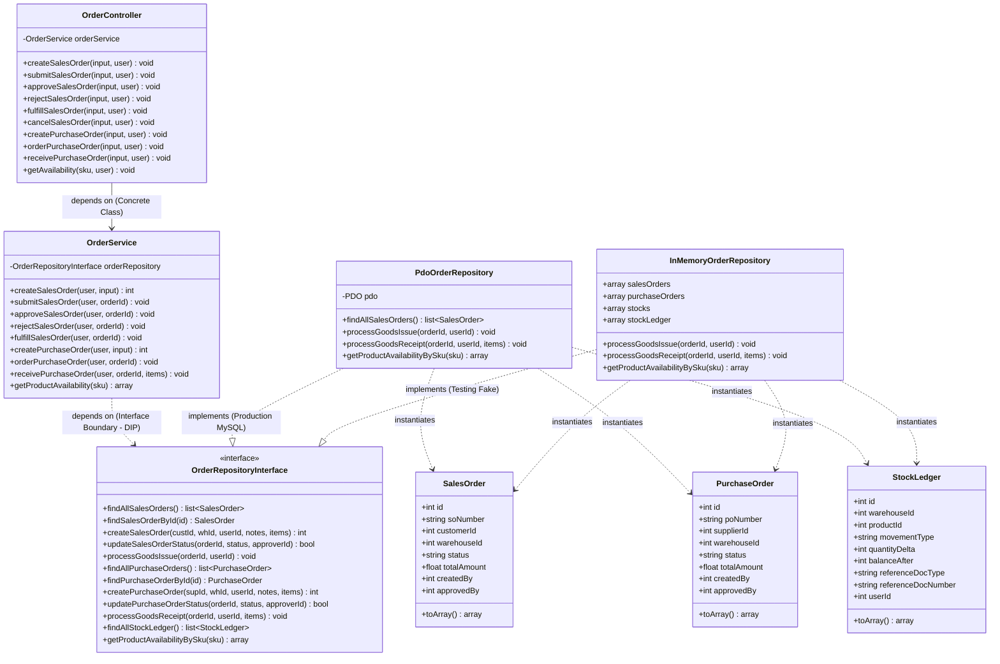

# Class Diagram — As-Built Final Architecture (DESIGN-01)

Dokumen ini merepresentasikan arsitektur final aktual (*as-built*) yang telah terimplementasi dan terverifikasi di dalam basis kode, membedakan secara tegas antara dependensi interface dan kelas konkret.

---

## 1. As-Built Class Diagram (Mermaid)

---

## 2. Analisis Perubahan: Initial vs As-Built

> **Perubahan Nyata & Alasan Desain**:
> 1. **Penambahan `InMemoryOrderRepository`**: Pada diagram initial hanya terdapat `PdoOrderRepository`. Pada as-built ditambahkan `InMemoryOrderRepository` yang mengimplementasikan `OrderRepositoryInterface` secara penuh, agar pengujian unit `OrderServiceTest` (TEST-01) dapat berjalan 100% terisolasi tanpa menyentuh koneksi database nyata, sesuai prinsip Dependency Inversion (ARCH-01).
> 2. **Pemisahan Metode Concurrency-Safe**: Pada interface dan implementasi ditambahkan tanda tangan metode eksplisit `processGoodsIssue` dan `processGoodsReceipt` yang membungkus Pessimistic Locking (`SELECT ... FOR UPDATE`) dan penulisan atomik `StockLedger` (ARCH-02), bukan sekadar update status biasa.
> 3. **Spesifikasi Kontrak Endpoint API**: Ditambahkan method `getProductAvailabilityBySku` pada boundary repository untuk mendukung kontrak endpoint JSON `GET /api/products/{sku}/availability` (API-01).
