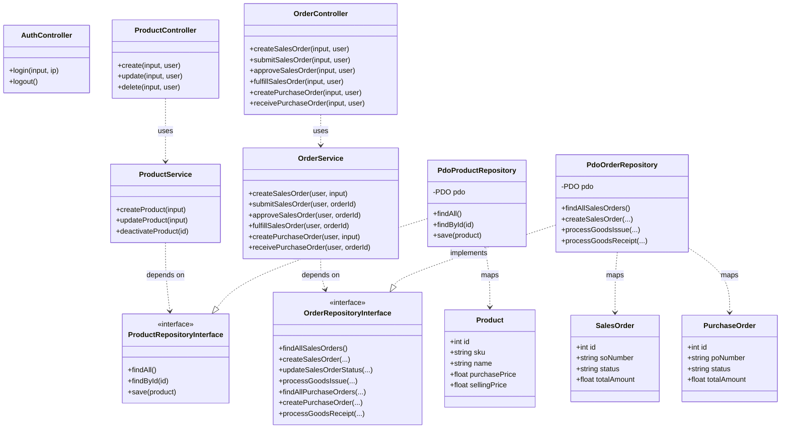

# Class Diagram — Initial Architecture Design (DESIGN-01)

Dokumen ini merepresentasikan rancangan awal diagram kelas sebelum seluruh kode fitur pesanan diimplementasikan secara mendalam.

---

## 1. Initial Class Diagram (Mermaid)

---

## 2. Catatan Refleksi Awal
Pada rancangan awal, seluruh dependensi diarahkan pada abstraksi interface repository, dengan asumsi implementasi tunggal berbasis MySQL PDO. Penanganan pengujian unit belum memodelkan in-memory fake repository secara eksplisit pada diagram awal ini.
