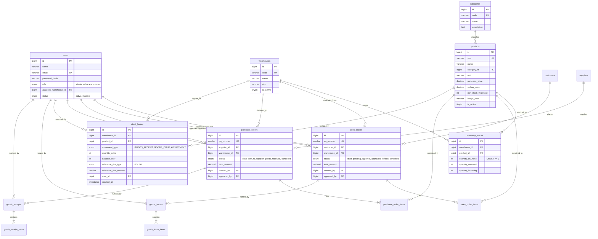

# Entity Relationship Diagram (ERD) — STOKORA

Dokumen ini memetakan relasi data, kunci primer/asing, dan batasan integritas (*integrity constraints*) sistem inventaris dan pesanan multi-gudang.

---

## 1. Diagram ERD (Mermaid)

---

## 2. Aturan Integritas Data Relasional (DB-01 & ARCH-02)

1. **Foreign Key Integrity**:
   - Seluruh relasi transaksi (`sales_orders`, `purchase_orders`, `stock_ledger`) memiliki Foreign Key eksplisit ke tabel master.
   - Penghapusan data master (*hard delete*) pada data yang memiliki relasi transaksi dilarang keras via constraint database. Status diganti melalui `is_active = 0` (*soft-deactivation*).
2. **Kekangan Non-Negatif (Check Constraint)**:
   - `inventory_stocks` memiliki constraint `chk_stk_qty_positive CHECK (quantity_on_hand >= 0)`. Hal ini menjamin bahwa database engine InnoDB akan menolak update apa pun yang menghasilkan stok minus.
3. **Audit Trail Mutasi Stok**:
   - Setiap mutasi saldo di `inventory_stocks` memiliki korespondensi 1-ke-1 dengan baris di `stock_ledger` yang dieksekusi dalam transaksi atomik yang sama.
